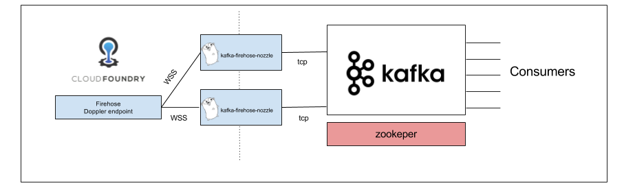

CFLOGS bosh release
=======================

Background
----------

### What is Cflogs?

Cloud Foundry loggregator firehose is fire and forget and can drop logs is you don't consume fast enough.

Most of the loggings system, like syslog, elasticsearch and so on are pretty slow and losting logs can happen especially in high traffic env.


So the idea is to use something fast enough to consumes the firehose stream without putting pressure on the final consumer.


Using Kafka, we can easily consume the firehose stream and we can use as much consumer as we want on the same kafka deployment.





Each Event Type message crate a topics so as today :

LogMessage
Counter
..
..
..


Consuming from Kafka
--------------------

If you have already some Nozzle the change should not be big as we can reuse you can find an example with [cf-kafka-to-syslog](https://github.com/shinji62/cf-kafka-to-syslog).


Component
---------

#### kafka-firehose-nozzle
Simply forward message from the firehose to kafka.
For topics and partition information please go directly to the Github  [repository](https://github.com/rakutentech/kafka-firehose-nozzle).

For now we install the nozzle on VM


### Kafka / Zookeeper / Kafka-Manager

Not Include in this bosh release we use [Zookeeper-release](https://bosh.io/d/github.com/cppforlife/zookeeper-release)
[kafka-release](https://bosh.io/d/github.com/cppforlife/zookeeper-release)

Usage
-----

First upload zookeeper, bpm and kafka release if you don't have it

```bash
$ bosh upload release https://bosh.io/d/github.com/cppforlife/zookeeper-release
$ bosh upload release https://bosh.io/d/github.com/cppforlife/zookeeper-release
$ bosh upload release https://bosh.io/d/github.com/cloudfoundry-incubator/bpm-release
```

Then upload this bosh release

```bash
$ bosh upload release https://github.com/shinji62/cflogs-boshrelease
```

Deploy

Please adapt to your own usage
```
bosh deploy -d cflogs ./manifest/manifest.yml  \
--vars-store ./creds.yml \
-o ./manifest/ops-files/kafka-all-in-one.yml \
-o ./manifest/ops-files/use-latest-version.yml  \
-o ./manifest/ops-files/cf-skip-ssl.yml  \
-v subscription_id=pcfdev \
-v nozzle_client_id=firehose-to-kafka  \
-v nozzle_client_secret=foobar \
-v doppler_address=doppler_address \
-v uaa_address=uaa_address \
-v subscription_id=pcfdev \
-v deployment_name=cflogs \
-v kafka_persistent_disk=10240 --no-redact

```


TODO
====
* Concourse Pipeline
